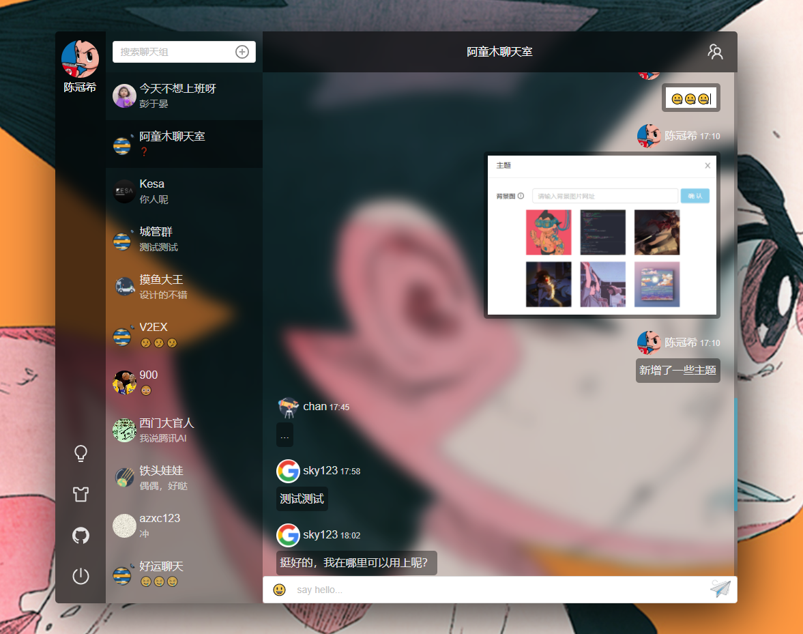
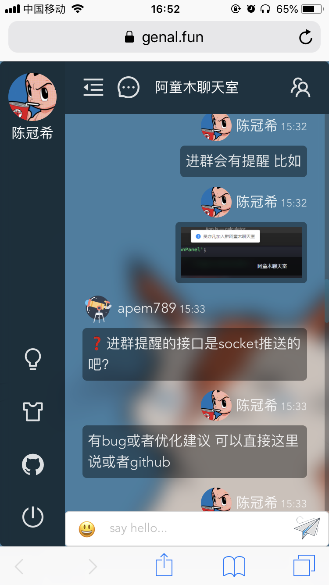
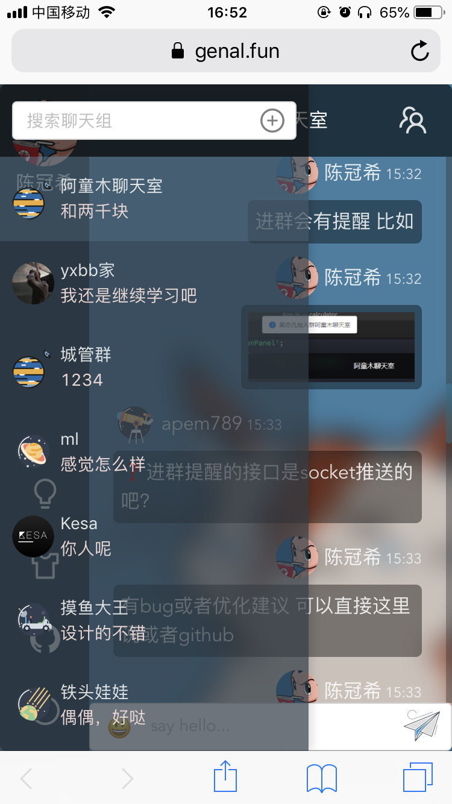
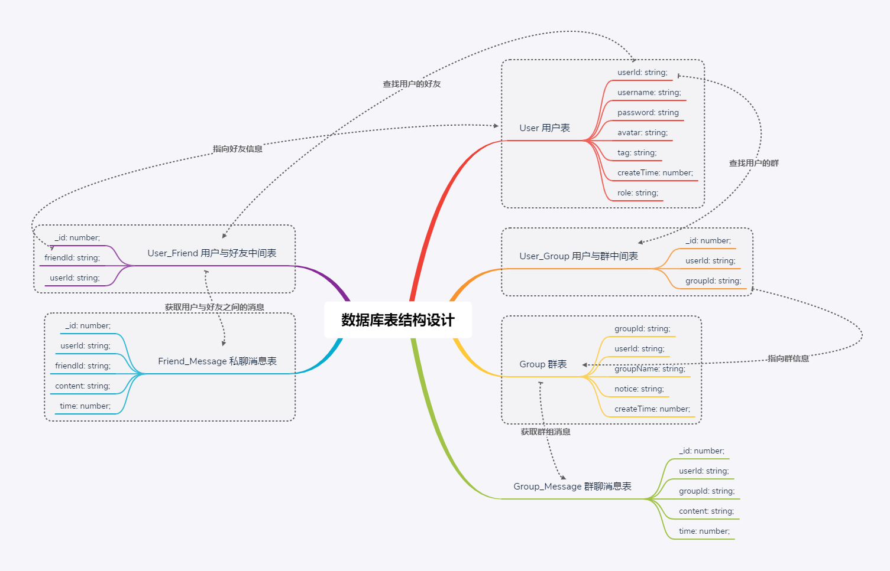
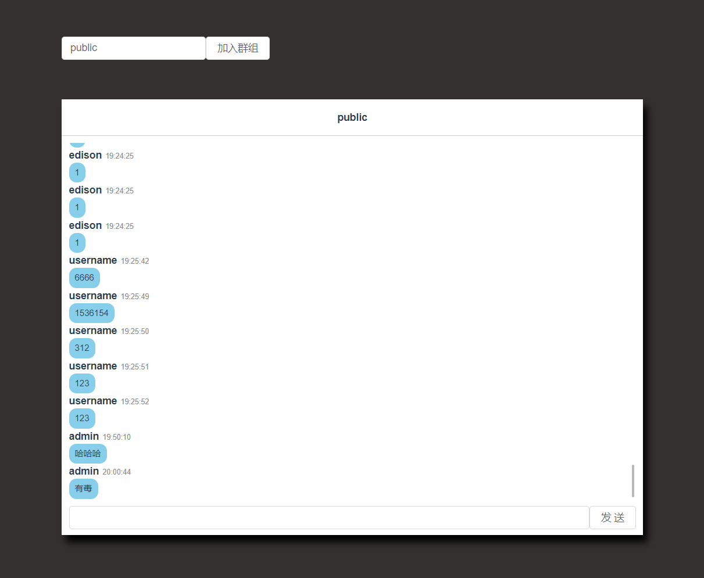
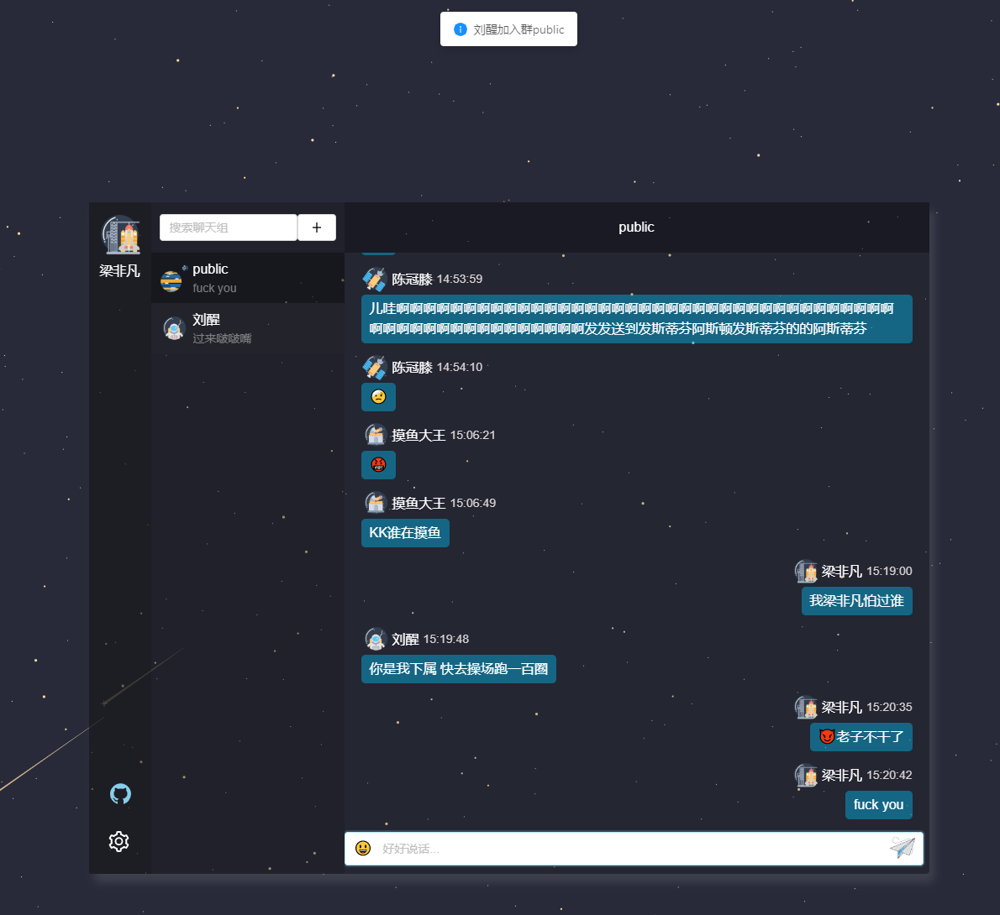
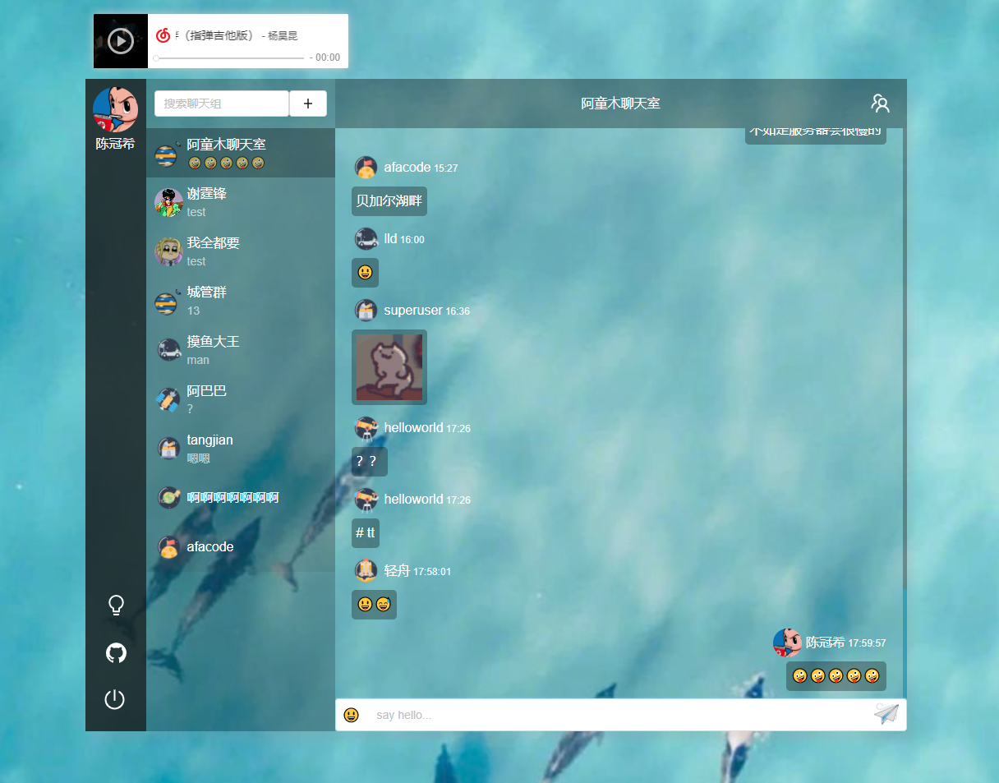

### 项目界面

#### PC 端



#### 移动端

<p align="center">
  
</p>

### 功能介绍

- 移动端兼容
- 用户信息的修改(头像/用户名/密码)
- 群聊/私聊
- 创建群/加入群/退群/模糊搜索群
- 添加好友/删好友/模糊搜索用户
- 消息分页
- 表情包
- 图片发送/图片预览
- 在线人数统计
- 自定义主题
- 重连提醒

### 技术概览

- **Typescript**：JavaScript 的一个超集，它最大的优势是提供了类型系统和提高了代码的可读性和可维护性。
- **Vue2.6.x**：前端渐进式框架。
- **Socket/io**：实现实时通信，websocket 第三方库。
- **Vuex**：专为 Vue.js 应用程序开发的状态管理模式。
- **Nestjs**：是一个用于构建高效、可扩展的 Node.js 服务端应用框架，基于 TypeScript 编写并且结合了 OOP1、FP2、FRP3 的相关理念。
- **Typeorm**: 支持最新的 JavaScript 特性并提供额外的特性以帮助你开发任何使用数据库的应用程序。
- **ES6+**：采用 ES6+语法，箭头函数、async/await 等等语法很好用。
- **SASS(SCSS)**：用 SCSS 做 CSS 预处理语言，可以使用最高效的方式，以少量的代码创建复杂的设计。

### 数据库表结构设计



### 环境配置

- 数据库 mysql 以及创建名字为 chat 的数据库,表无需创建 (注意选数据库的时候要选 utf8mb4 这种数据库格式)
- node v10.16.3

### 运行项目

1. 前端项目

```js
cd genal-chat-client
npm i
npm run serve
```

2. mysql 配置<br>
   如果 mysql 连不上并报错 error: ER_NOT_SUPPORTED_AUTH_MODE， 是 mysql 版本不兼容导致，参考这篇文章https://blog.csdn.net/qq_41831345/article/details/83150502<br>
   数据库没有 sql 脚本，直接改后端`app.module.ts`中的数据库密码，新建个`chat`数据库了就行

3. 后端项目

```js
cd genal-chat-server
npm i
npm run start:dev
```

### 系统迭代记录

<details>
<summary>点击查看</summary>

### v1.0.0

##### 功能

- 新增用户
- 新增群
- 群聊

##### v1.0.0 界面



### v2.0.0

##### 功能

- 群聊/私聊
- 创建群/加入群聊/模糊搜索群
- 添加好友/模糊搜索好友
- 更改用户名/头像上传
- 表情包
- 消息分页

##### v2.0.0 界面



### v3.0.0

##### 功能

- 群聊/私聊
- 创建群/加入群聊/模糊搜索群
- 添加好友/模糊搜索好友
- 图片上传/粘贴发送图片/图片预览
- 更改用户名/头像上传
- 表情包
- 消息分页

##### v3.0.0 界面

同 v2.0.0

### v4.0.0

##### 功能

- 群聊/私聊
- 创建群/加入群聊/模糊搜索群
- 添加好友/模糊搜索好友
- 图片上传/粘贴发送图片/图片预览
- 更改用户名/头像上传
- 表情包
- 消息分页
- 移动端兼容

##### v4.0.0 界面

同 v2.0.0

### v5.0.0

##### 功能

- 群聊/私聊
- 创建群/加入群聊/退群/模糊搜索群
- 添加好友/删好友/模糊搜索好友
- 图片上传/粘贴发送图片/图片预览
- 更改用户名/头像上传
- 表情包
- 消息分页
- 移动端兼容
- 在线人数统计
- 重连提醒

##### v5.0.0 界面



### v6.0.0

##### 功能

- 移动端兼容
- 用户信息的修改(头像/用户名/密码)
- 群聊/私聊
- 创建群/加入群/退群/模糊搜索群
- 添加好友/删好友/模糊搜索用户
- 消息分页
- 表情包
- 图片发送/图片预览
- 在线人数统计
- 自定义主题
- 重连提醒

##### v6.0.0 界面


</details>


### 如何部署

[聊天室部署说明](./聊天室部署说明.md)


